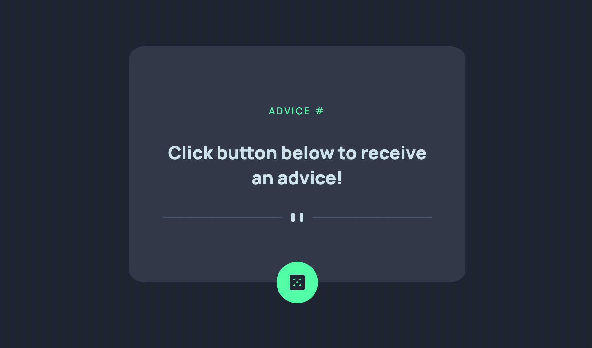

# Frontend Mentor - Advice generator app solution

This is a solution to the [Advice generator app challenge on Frontend Mentor](https://www.frontendmentor.io/challenges/advice-generator-app-QdUG-13db). Frontend Mentor challenges help you improve your coding skills by building realistic projects.

## Overview

### The challenge

Your challenge is to build out this advice generator app using the [Advice Slip API](https://api.adviceslip.com) and get it looking as close to the design as possible.

You can use any tools you like to help you complete the challenge. So if you've got something you'd like to practice, feel free to give it a go.

Your users should be able to:

- View the optimal layout for the app depending on their device's screen size
- See hover states for all interactive elements on the page
- Generate a new piece of advice by clicking the dice icon

### Screenshot

- Solution URL: [Add solution URL here](https://github.com/DanK1368/advice_generator_app)
- Live Site URL: [Add live site URL here](https://dank1368.github.io/advice_generator_app/)

## My process

### Built with

- Semantic HTML5 markup
- SASS with custom variables & mixins
- Flexbox
- CSS Grid
- Mobile-first workflow

**Note: These are just examples. Delete this note and replace the list above with your own choices**

### What I learned

- Use async & await to fetch the data from the specified api endpoint.
- Integrate the click event on the button so that when a user clicks on it, it displays a new advice.
